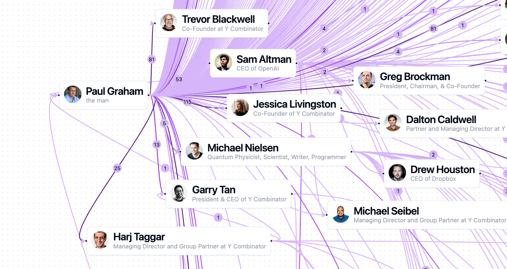

<a href="https://pgnumber.com?ref=pg-number">
  
  <h1 align="center">PG Number</h1>
  <p align="center"><b>
    "Collaborative Distance" from Paul Graham
  </b></p>
</a>


<div align="center">
    <h3>Sponsors</h3>
    <a href="https://webtranspose.com?ref=pg-number">
    
    </a>
</div>

<br/>

----

## What is the PG Number?

*Inspired by the [Erdős Number](https://en.wikipedia.org/wiki/Erd%C5%91s_number), the PG Number is a measure of how many degrees of separation there are between a person and Paul Graham.*

An edge on the PG Number graph can be any work of collaboration between two individuals. This includes:
- Essays
- Academic Publications
- Co-Founders
- Blog Posts
- Podcasts

## Visualize

[PG Number & Essay Graph](https://pgnumber.com) is updated live with this repo.


## Contribute

Got some data? [Submit a PR!](https://github.com/mike-gee/pg-number/pulls)

Please submit data from whole websites, rather than individual web pages. 

## Getting Data

We got this data using the [Web Transpose AI Web Scraper](https://www.webtranspose.com/ai-web-scraper). Here's a tutorial on how to use it: [How to Extract Thanked People from a Blog](https://www.webtranspose.com/blog/examples/extract-thanked-people-from-blog).


## Data Format & Reading Data

- `nodes.jsonl`: Data about **People**.
- `edges.jsonl`: **Relationships** between people.

Example reading JSONL data in Python using Pandas:

```python
import pandas as pd
edges_df = pd.read_json('edges.jsonl', lines=True)
```

## Usage

Data is free to use to build derivative projects! Please link back to this repo.

```html
<p>
Built using data from <a href="https://pgnumber.com">PG Number</a>, available on <a href="https://github.com/mike-gee/pg-number">Github</a>.
</p>
```

